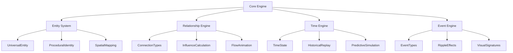
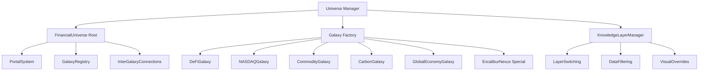
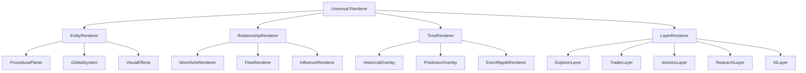
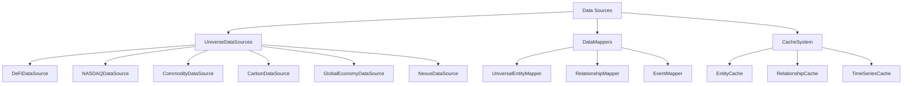
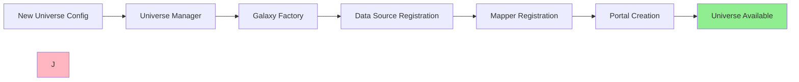

# Universal Engine Dependency Graph

## System Architecture Dependencies

### Core Engine (Foundation Layer)



### Universe Management Layer



### Renderer Layer (Pure Rendering)



### Data Layer



## Dependency Flow

### 1. Data Flow Dependencies

```
Data Sources → Data Mappers → Core Engine → Universe Manager → Renderer
```

**Explanation:**
- Raw data flows through specialized mappers
- Mappers create universal entities
- Core engine processes relationships and time
- Universe manager organizes into galaxies
- Renderer displays final visualization

### 2. Core Engine Dependencies

```
Entity System ← Relationship Engine ← Time Engine ← Event Engine
```

**Explanation:**
- Entity System provides foundation
- Relationship Engine connects entities
- Time Engine adds temporal dimension
- Event Engine creates dynamic effects

### 3. Renderer Dependencies

```
EntityRenderer ← RelationshipRenderer ← TimeRenderer ← LayerRenderer
```

**Explanation:**
- EntityRenderer handles individual objects
- RelationshipRenderer adds connections
- TimeRenderer overlays temporal data
- LayerRenderer applies knowledge filters

## Adding New Universes Without Renderer Changes

### 1. Universe Registration Flow



### 2. Renderer Isolation

```mermaid
graph TD
    A[New Universe Data] --> B[UniversalEntityMapper]
    B --> C[UniversalEntity[]]
    C --> D[Universal Renderer]
    D --> E[Visual Output]
    
    F[Existing Universe Data] --> G[UniversalEntityMapper]
    G --> H[UniversalEntity[]]
    H --> D
    
    style D fill:#FFB6C1
    style C fill:#ADD8E6
    style H fill:#ADD8E6
```

**Key Point:** The renderer (D) receives the same data structure regardless of universe type.

### 3. Implementation Steps for New Universe

```typescript
// Step 1: Configuration (No renderer change)
const NEW_UNIVERSE: UniverseConfig = {
  id: 'new-universe',
  entityHierarchy: [...],
  dataSources: [...],
  visualTheme: {...}
};

// Step 2: Data Mapping (No renderer change)
class NewUniverseMapper implements DataMapper {
  mapToEntity(rawData): UniversalEntity {
    return {
      // Universal structure
      entityType: EntityType.NEW_TYPE,
      spatialProperties: this.calculateSpatial(rawData),
      proceduralIdentity: this.generateIdentity(rawData)
    };
  }
}

// Step 3: Registration (No renderer change)
UniverseManager.registerUniverse(NEW_UNIVERSE);
UniverseManager.registerMapper(EntityType.NEW_TYPE, new NewUniverseMapper());

// Step 4: Portal Connection (No renderer change)
PortalSystem.connect('existing-universe', 'new-universe');

// Result: Renderer automatically handles new universe
```

## System Guarantees

### 1. Renderer Independence
- **Guarantee:** Renderer never contains `if` statements for entity types
- **Enforcement:** All renderer inputs are `UniversalEntity` or `EntityConnection`
- **Testing:** Same renderer code must work for all universe types

### 2. Universe Extensibility
- **Guarantee:** New universes require zero renderer modifications
- **Enforcement:** Universe registration is configuration-driven
- **Testing:** Add new universe without touching renderer code

### 3. Data-Driven Visualization
- **Guarantee:** All visual properties calculated from data
- **Enforcement:** No hardcoded visual parameters
- **Testing:** Change data input → visual output changes predictably

### 4. Temporal Consistency
- **Guarantee:** Time engine works across all universes
- **Enforcement:** Time state is universe-agnostic
- **Testing:** Time manipulation affects all universes equally

### 5. Relationship Universality
- **Guarantee:** Relationship engine handles any connection type
- **Enforcement:** Connections are data-driven, not type-specific
- **Testing:** Same relationship visualization for all entity types

## Performance Dependencies

### 1. Caching Strategy
```
Entity Cache → Relationship Cache → Time Series Cache → Visual Cache
```

### 2. Level of Detail (LOD)
```
Distance-Based LOD → Entity Simplification → Relationship Culling → Layer Filtering
```

### 3. Memory Management
```
Universe Pooling → Entity Recycling → Texture Sharing → Geometry Instancing
```

## Testing Strategy

### 1. Unit Tests
- Core Engine components
- Data mappers
- Spatial calculations
- Time engine logic

### 2. Integration Tests
- Universe registration
- Portal traversal
- Data flow end-to-end
- Cross-universe consistency

### 3. Renderer Tests
- Entity rendering with different data types
- Relationship visualization
- Time overlay effects
- Layer switching

### 4. Performance Tests
- Multi-universe rendering
- Large entity counts
- Complex relationship networks
- Time series playback

## Deployment Dependencies

### 1. Core Engine Deployment
- Must be deployed first
- Provides foundation for all universes
- Version compatibility critical

### 2. Universe Deployment
- Can be deployed independently
- Hot-swappable without downtime
- Configuration-driven updates

### 3. Renderer Deployment
- Updates must maintain backward compatibility
- Visual changes should be data-driven
- Performance optimizations universal

---

## Summary

The dependency graph ensures:

1. **Clear Separation:** Each layer has distinct responsibilities
2. **Universal Renderer:** Renderer works with any data type
3. **Easy Extension:** New universes require zero renderer changes
4. **Maintainable Architecture:** Dependencies flow one direction
5. **Testable Components:** Each layer can be tested independently

The key insight: **All intelligence lives in data processing, not rendering.** The renderer is a universal visualization engine that transforms universal entities into visual elements without knowing what those entities represent.
